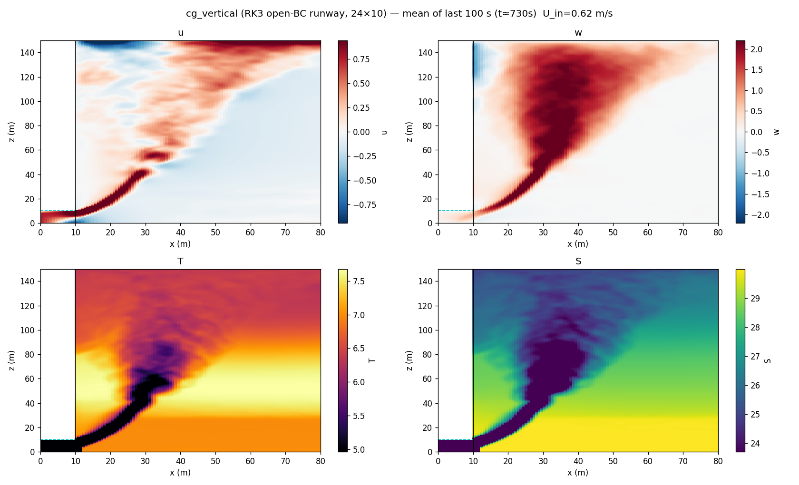
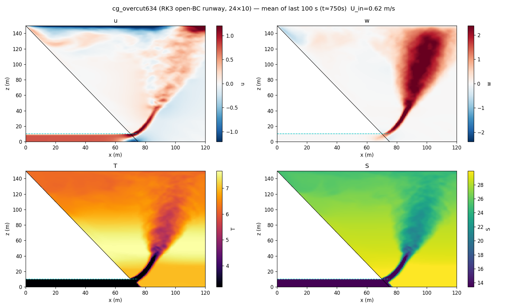
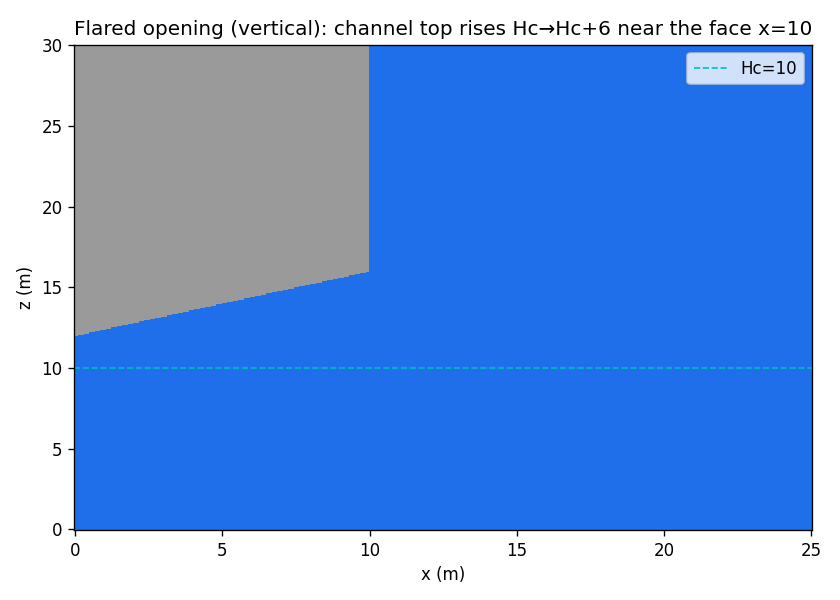

# SGD-plume LES — geometric terminus, Oceananigans 0.109 (CG solver)

The newer-Oceananigans build of `../newLES`. The terminus is represented **geometrically**
(immersed ice face) with **vertical gravity** — the faithful setup — instead of the
gravity-tilt idealisation. The immersed boundary is solved with the
**`ConjugateGradientPoissonSolver`** (not the approximate FFT solver), which removes the
near-boundary pressure artifacts.

Built on the pinned **0.109.2** environment from the sibling `IceShelfCavity` project
(`Project.toml`; no `Manifest.toml` is committed — each machine resolves fresh).

## Results (2024 conditions)

Vertical and overcut runs at the 2024 setup — grounding-line depth 150 m, discharge 150 m³/s,
24 × 6 m outlet (the paper's point-plume geometry) — with the discharge injected through an **open-boundary subglacial channel**
(the "runway"), stepped with **RungeKutta3** for stability, on an x/y/z-stretched (~85 M-cell)
grid. x–z transects of `u, w, T, S` (mean of the last 100 s, ≈ 12 min of model time):

**Vertical terminus (90°)**



**Overcut terminus (63.4°)**



Both show the fresh discharge running the conduit at ≈ U_in, exiting the ice-face opening, and
rising as a turbulent plume. A **flared opening** (`--flare`, below) softens the sharp top edge
of the outlet that otherwise accelerates the exit ~2× and over-tilts the near-field plume:



## What's different vs. `../newLES` (0.90.7, gravity-tilt)

| | `newLES` (0.90.7) | `newLES_cg` (0.109) |
|---|---|---|
| Terminus tilt | rotate gravity (frame tilt) | **geometry**: immersed ice face, gravity vertical |
| Floor & surface | cavity mask in a tilted box | **domain boundaries** z=0 / z=Lz (no cavity) |
| Pressure (immersed) | FFT (approximate, near-wall noise) | **ConjugateGradientPoissonSolver** |
| Discharge | interior nudge | **open-boundary subglacial channel** (runway); closed-nudge fallback |
| Timestepper | QuasiAdamsBashforth2 | **RungeKutta3** (needed for open-BC stability) |
| Ambient | along ζ = z·cosθ − x·sinθ | simply **T(z)** (z = true height) |
| Quick-look | un-rotates to true x-z | already true x-z (no rotation) |

## Terminus geometry & discharge injection

Ice = immersed solid where `x < x_face(z) = xf_a + xf_b·z`, with β = 90 − face_angle:

- **Overcut** (`--terminus=overcut`, default): `x_face(z) = (Lz−z)·tanβ` — base sticks out to
  x = Lz·tanβ, recedes to x=0 at the surface (slopes **away** from the ocean going up).
- **Undercut** (`--terminus=undercut`): `x_face(z) = z·tanβ` — top overhangs toward the ocean.
- **Vertical** (`--face_angle=90`): a thin immersed slab (so all cases use the same immersed path).

A **subglacial channel** (the discharge conduit) is carved out of the ice base: a `W×H` opening
(`--outlet_w/h`, default **24 × 10 m**) extruded in x from the domain back-wall to the terminus
face, with a minimum length `--channel_len` (the face shifts out if the natural length is
shorter). The top edge of the opening is **flared** (`--flare` m over `--flare_len` m) so the
discharge exits under a chamfered roof rather than separating off a sharp corner.

**Injection modes (`--inject`):**

- **`open`** (default) — the discharge is a genuine **open-boundary inflow** through the channel
  opening (tapered to zero at the outlet edges), delivering Q = 150 m³/s and driving a coherent
  along-channel jet — the **runway** — that trips the plume turbulent at the channel→fjord
  transition. Balanced by a smooth outflow at the east boundary above 60 m depth (net flux ≈ 0).
  A closed-wall momentum nudge cannot drive net through-flow, so the open boundary is required
  for the runway. **Needs `--timestepper=RK3`** — QuasiAdamsBashforth2 blows up (NaN) at the
  sharp immersed outlet edges; RK3's sub-stage stability holds.
- **`closed`** — fallback: no open boundaries; the discharge is an interior nudge (u→U_in, T,S→0)
  in the conduit balanced by an east outflow sponge (saqqarleq-style). Robustly stable and faster,
  but buoyancy-driven (u ≈ 0 in the conduit — no crisp runway).

T and S are relaxed to fresh/cold (0, 0) **strictly inside the conduit** (`x < x_face`), with the
relaxation rate **tapering to zero at the opening** so tracers are set deep and advect out gently.

## Run it

```bash
# 0. one-time environment (Julia ≥ 1.10). No Manifest.toml on purpose — resolve fresh:
julia --project -e 'using Pkg; Pkg.instantiate(); Pkg.precompile()'

# 1. CPU smoke test — compiles, steps, CG converges, ice/channel geometry looks right
julia --project iceplume.jl --arch=cpu --face_angle=63.4 --stop_time=1 --simname=cgtest
python3 plot_quicklook.py cgtest      # -> output/cgtest_slices.png (immersed ice blanked)

# 2. production (GPU) via the batch script — open runway + RK3, stretched paper-scale domain:
qsub -v CASE=vertical,TS=RK3,OUTDIR=/glade/work/$USER/LESplume_runs submit_pbs.sh
qsub -v CASE=overcut,TS=RK3,OUTDIR=/glade/work/$USER/LESplume_runs submit_pbs.sh
```

`submit_pbs.sh` applies the GPU domain: 743 m wide × 4 km long × 150 m deep, **0.75 m fine near
the terminus/plume**, stretched in x (to 18.6 m), y (fine middle 300 m → 8 m at the walls) and
kept uniform in z. ≈ **85 M cells** (the z-stretch was dropped — its surface sliver cell was a
stability hazard). It's **restartable**: checkpoints, and re-submitting the same command resumes.
RK3 is ~5× slower than QAB2 (3 pressure solves/step), so the full 45-min run takes a few 23 h legs.

`DIAG=1` runs a short (2 min), 1-s-slice diagnostic in a `<OUTDIR>_diag` folder — for catching a
NaN's location fast. Experiment knobs pass through `-v`: `TS` (RK3/QAB2), `WENO`, `NU`
(explicit viscosity), `SLOPE` (floor ramp), `INJECT` (open/closed), `TAG` (parallel runs).

Driver flags: `--discharge --outlet_w/h --Lz --Lx --fine_x --dz --dx_max --fine_y --dy_max
--fine_z --dz_surf --channel_len --flare --flare_len --sig_src --inject --timestepper --weno
--nu --bottom_slope --stop_time --output_interval --slice_interval --checkpoint_interval
--wall_time_limit --terminus --face_angle --arch --simname --outdir`.

## Visualizing results — plot where the data lives, move only the light files

The 3-D `*_fields.nc`/`*_timeavg.nc` are large; the 2-D `*_midy.nc`/`*_face.nc` slices are small.

1. **On Casper — make PNGs + movies next to the data**:
   ```bash
   OUTDIR=/glade/work/$USER/LESplume_runs ./postprocess.sh   # quick-look PNGs + w/T/S movies
   ```
2. **On your laptop — pull just the light files** (slices, time-average, PNGs, movies), then
   `python3 plot_quicklook.py cg_overcut634 --dir output` to re-plot/explore. `plot_quicklook.py`
   prints a **channel-throughput check** (Q vs the prescribed 150 m³/s) and blanks the immersed
   ice while keeping the carved channel visible.
3. **GitHub is for code + curated figures**: commit final plots to `figures/` (whitelisted in
   `.gitignore`); run outputs (`output/`, `*.nc`, movies) are ignored.

## Fidelity to Ovall et al. (2025, JGR-Oceans) LES

| spec | Ovall 2025 | here | note |
|---|---|---|---|
| Injection | channel at glacier midpoint, base | open-BC channel/runway at midpoint, base | ✓ match (method) |
| Terminus | vertical 90°, overcut 78.7/71.6/63.4° | same (`--face_angle`, `--terminus`) | ✓ match |
| Grid resolution | 0.75 m (fine region) | **0.75 m** (`--dz`) | ✓ match |
| Fine region width | 375 m from terminus | **375 m** (`--fine_x`) | ✓ match |
| Along-fjord stretch | up to 18.6 m | **18.6 m** (`--dx_max`) | ✓ match |
| Fjord-exit outflow | above 60 m depth, 0 below, = SGD flux | same (smooth tanh profile) | ✓ match |
| Run length / average | 45 min / last 15 min | **45 min / 15-min window** | ✓ match |
| SGS closure | Deardorff (1980) + Ducros (1996) | AnisotropicMinimumDissipation | ~ both LES; different scheme |
| Outlet | 24 m × 6 m | 24 m × 6 m | ✓ match (paper geometry) |
| **Discharge** | 75 m³/s | **150 m³/s** | *2024 value* (`--discharge`) → U_in = 1.04 m/s (2× paper's 0.52) |
| **Grounding-line depth** | 172 m | **150 m** | *2024 value* (`--Lz`) |
| **Ambient T/S** | 2018 BPT profile | **2024 cast** | *2024 value* |
| Fjord width `Ly` | 743 m | **743 m** (stretched: fine middle 300 m) | ✓ (y-stretched for cost) |
| Fjord length `Lx` | 8,300 m | 4,000 m | near-field-focused; captures the subducting intrusion |

Bold/italic rows are deliberate 2024-condition or cost choices.

## Performance & stability

- **Timestepper = RungeKutta3** for the open-BC runway. QuasiAdamsBashforth2 is 3× cheaper (one
  pressure solve/step) but NaNs at the sharp immersed outlet edges; RK3 is stable there. Use QAB2
  only with `--inject=closed`.
- **GPU only** for anything beyond a smoke test (`--arch=gpu`, forced in `submit_pbs.sh`). Do NOT
  add `--pkgimages=no` — it breaks CUDA.jl's GPU detection (`has_cuda_gpu()→false`).
- **CG tolerance / iteration cap**: `--cg_reltol` (default 1e-5), `--cg_maxiter` (default 30). The
  solver uses the FFT solver as a preconditioner; a **smooth** outflow profile (no hard jump) keeps
  the preconditioner effective.
- **Cost levers**: smaller `--Ly`/`--Lx`, `--inject=closed` (much faster), or coarser `--dz`.
- **Stability levers if a run NaNs**: `--flare`/`--flare_len` (soften outlet edge), `--weno=3` and
  `--nu` (add dissipation — but explicit `--nu` has its own diffusive-CFL limit; the wizard only
  caps the advective CFL), `--bottom_slope` (soften the grounding-line corner). Diagnose the
  blow-up location with `DIAG=1` (1-s slices).

## Status / caveats

- The open-BC runway is stable on **RK3** (both vertical and overcut ran past 12 model-min with
  bounded velocities). The near-field plume tilts seaward in the bottom ~60 m (jet momentum, mildly
  amplified at the outlet edge) then rises vertically; the `--flare` opening is aimed at reducing
  that tilt toward a more wall-attached plume.
- Immersed **drag** = quadratic on all three components via `FieldBoundaryConditions(immersed=…)`.
  Melt is not included (discharge-plume study).
- Ambient fit (`ambient_profile.jl`) and `verify_setup.py` (BPT) are shared with `newLES`.
